# AgentClaw - OpenClaw 多用户 Agent 平台（面向小团队）


[English README](README.md)

通过各种开源项目的启发与学习，站在巨人肩膀上各种魔改vibe后攒了一个这个，部分代码来源于开源社区，现在反馈回来，希望对大家有启发或帮助，如果您觉得有价值帮忙点点star⭐️。
欢迎提 issue 反馈问题。

把 **OpenClaw 的单用户 Agents** 改造为 **多租户可用的 Agent 平台**，提供统一入口、用户隔离、共享实例、动态沙盒与安全治理能力，适合小团队快速搭建内部 Agent 平台。

**AgentClaw** 提供多用户的 Agent 运行与治理能力。每个用户在独立的 Docker 沙盒中运行自己的 Agent 会话与工作流。

多租户架构，基于 OpenClaw 与生俱来的能力实现共享实例 + 动态agent沙盒的租户隔离方案。

## 核心特性

- **🔌 零侵入集成** - 不修改 OpenClaw 源码，通过 Bridge 层实现多租户，理论上可随openclaw更新
- **🧩 多用户 Agent 平台** - 小团队统一入口、用户隔离、Agent 生命周期管理
- **🐳 严格沙盒隔离** - 每用户独立 Docker 容器，预装 Python/Node/工具链
- **🌐 网络访问** - 支持 API 调用、包安装、网络爬取
- **🔒 安全治理** - 自动化安全审查与最小权限能力限制
- **📦 资产沉淀** - 技能/工作流/工具可复用并共享到平台
- **🧩 自由组合** - 支持定制多种 Agent，面向自己或团队共享，技能包可自由组合与复用

## 系统架构

AgentClaw 基于openclaw为基础采用多租户架构：共享openclaw实例 + 动态agent沙盒：

```
┌─────────────────────────────────────────────────────────────────┐
│                        用户浏览器                                │
│                   Frontend (React + Vite)                       │
└───────────────────────────┬─────────────────────────────────────┘
                            │ HTTP / WebSocket
┌───────────────────────────▼─────────────────────────────────────┐
│                    Platform Gateway                              │
│                   FastAPI + PostgreSQL                           │
│  ┌─────────────┐  ┌─────────────┐  ┌─────────────────────────┐  │
│  │  JWT 认证   │  │  LLM 代理   │  │  共享实例生命周期管理    │  │
│  └─────────────┘  └─────────────┘  └─────────────────────────┘  │
└───────────────────────────┬─────────────────────────────────────┘
                            │
┌───────────────────────────▼─────────────────────────────────────┐
│                  OpenClaw Shared Instance                        │
│  ┌─────────────────────────────────────────────────────────┐    │
│  │  Bridge (HTTP API)  ◄──►  OpenClaw Gateway (Agent 引擎)  │    │
│  └─────────────────────────────────────────────────────────┘    │
│                              │                                  │
│         ┌────────────────────┼────────────────────┐             │
│         │                    │                    │             │
│    ┌────▼────┐         ┌────▼────┐         ┌────▼────┐        │
│    │ Sandbox │         │ Sandbox │         │ Sandbox │        │
│    │ User A  │         │ User B  │         │ main    │        │
│    └─────────┘         └─────────┘         └─────────┘        │
└─────────────────────────────────────────────────────────────────┘
```

## 系统演示

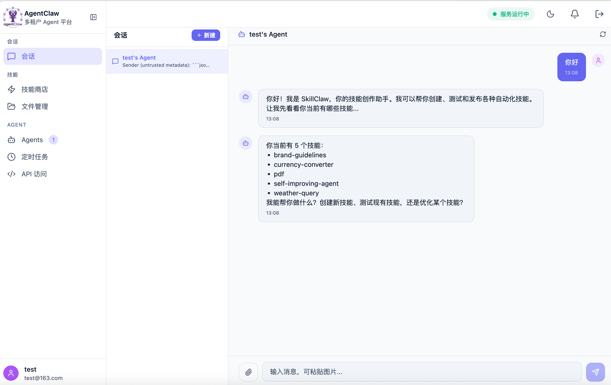
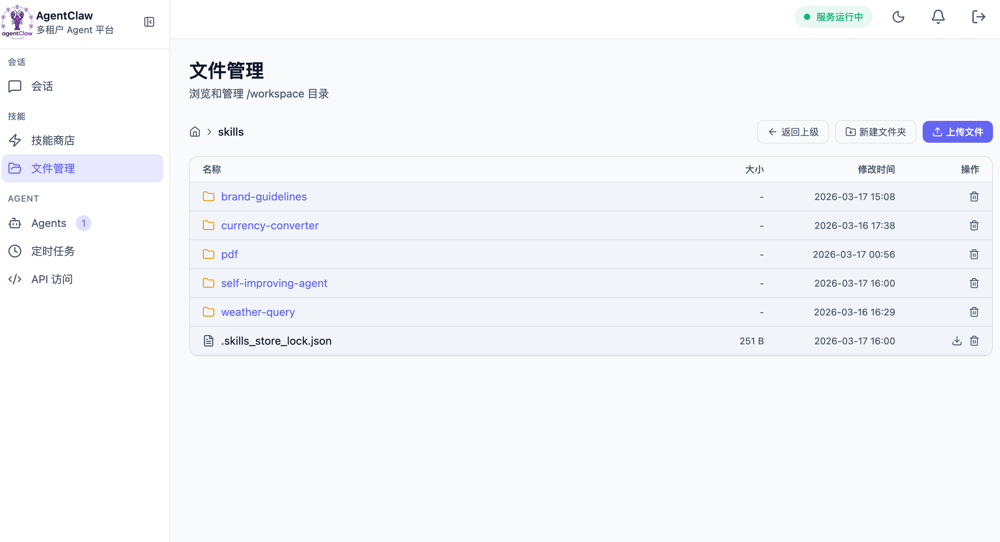
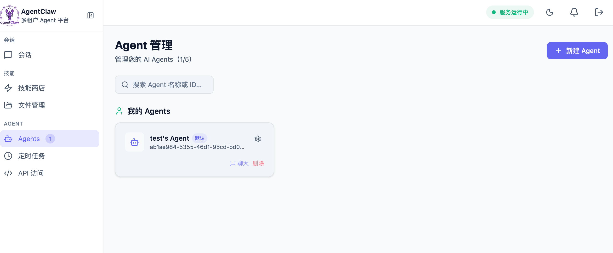
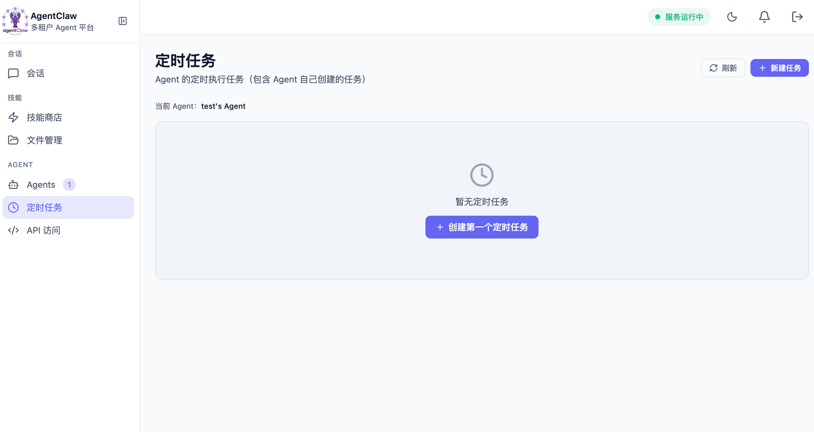
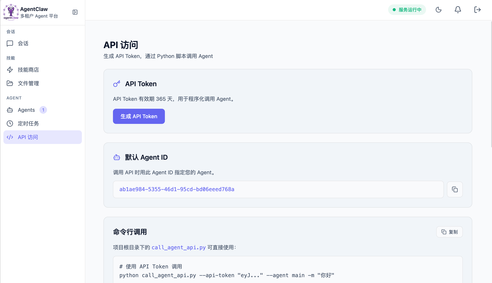
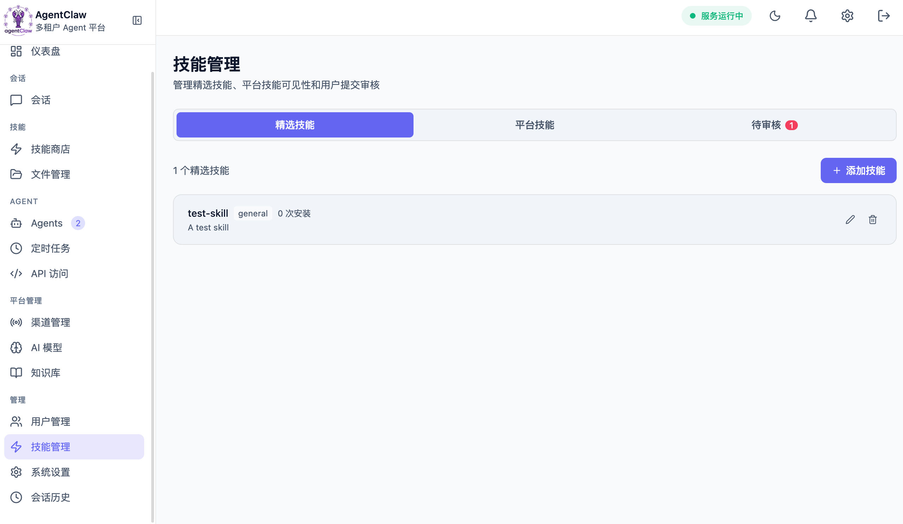
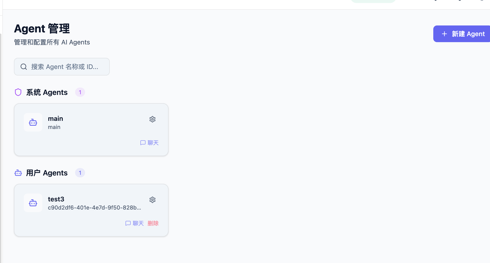
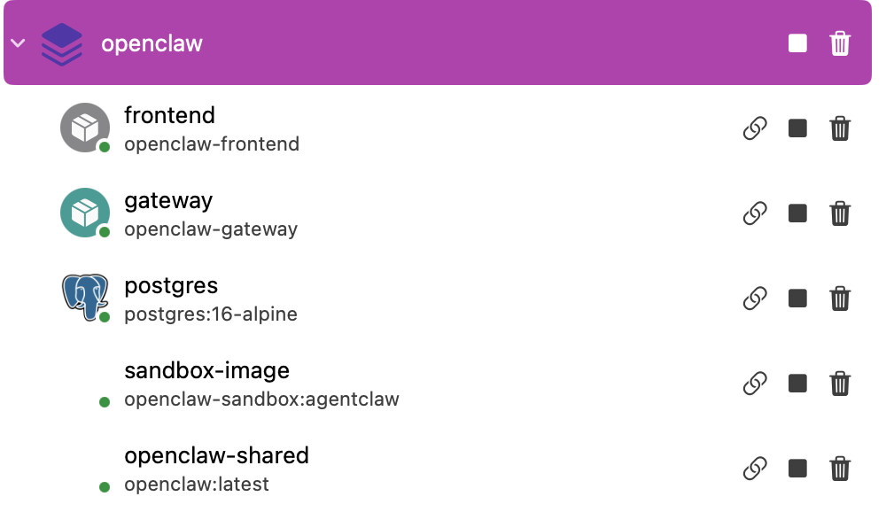
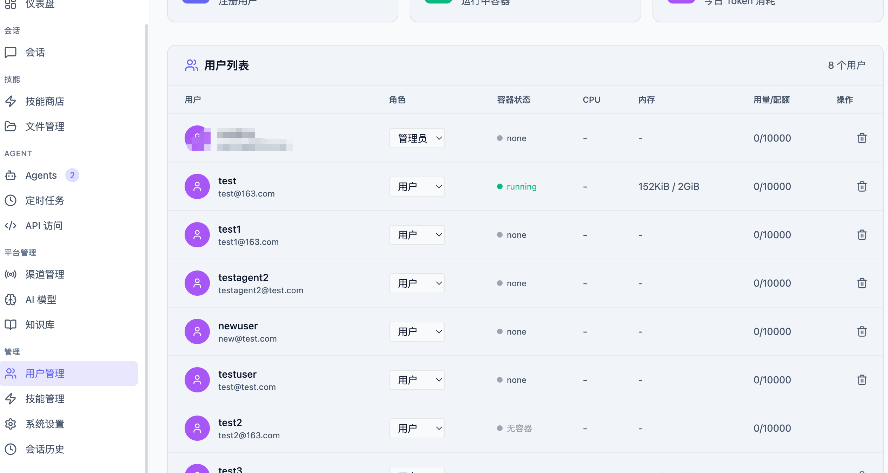
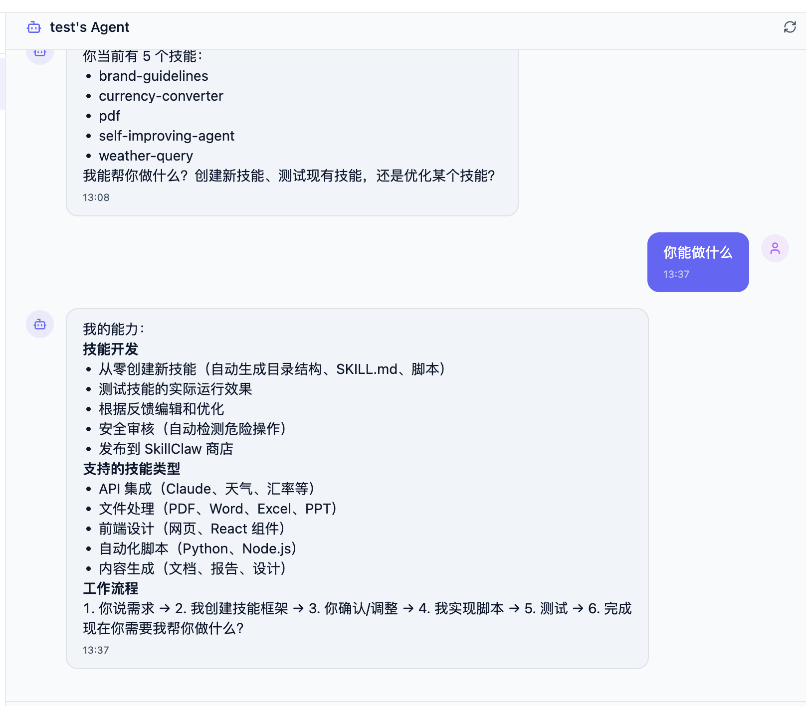
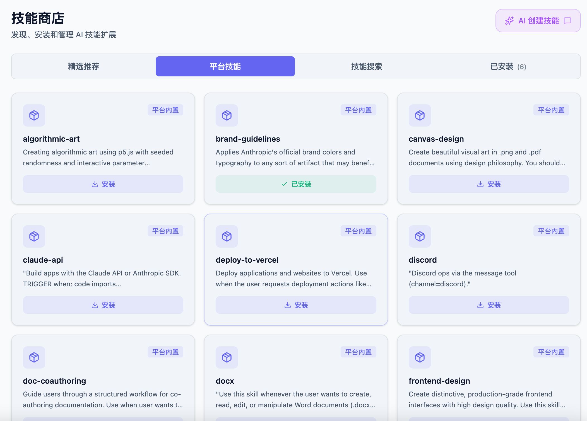

### 零侵入集成

agentClaw **不修改 OpenClaw 源码**，通过 Bridge 适配层实现多租户能力：

```
OpenClaw (上游源码)
    │
    │ 原生 WebSocket / RPC
    │
    ▼
Bridge (适配层) ───► HTTP API + 多租户路由
    │
    │ 配置注入
    │
    ▼
Platform Gateway (认证/代理)
```

**Bridge 层职责：**
- 将 OpenClaw 的 WebSocket RPC 转换为 REST API
- 注入多租户配置 (`X-Agent-Id` 路由)
- 管理 per-agent workspace 目录
- 转发 LLM 请求到 Platform Gateway

这样 AgentClaw 可以跟随 OpenClaw 官方版本更新，无需维护 fork。

### 多 Agent 设计

OpenClaw 原生支持多 Agent，AgentClaw 利用此能力实现租户隔离：

| 概念 | 说明 |
|------|------|
| Agent ID | 用户唯一标识（如 `08f95579-5ad0-48f6-a945-1233309a4fc0`）|
| Workspace | 每个 Agent 独立目录 `~/.openclaw/workspace-{agentId}/`|
| 沙盒 | 代码执行时动态创建 Docker 容器，执行后销毁 |
| 会话 | `agent:{agentId}:{sessionKey}` 格式路由 |

### 沙盒配置

默认沙盒镜像配置：

```json
{
  "sandbox": {
    "mode": "all",           // 所有会话使用沙盒
    "scope": "agent",        // 每 Agent 独立沙盒
    "workspaceAccess": "rw", // 读写 workspace
    "docker": {
      "image": "openclaw-sandbox:agentclaw",
      "readOnlyRoot": false,
      "network": "bridge",
      "user": "0:0",
      "memory": "2g",
      "cpus": 2,
      "pidsLimit": 256,
      "capDrop": ["ALL"]
    }
  }
}
```

## 快速开始（运行 AgentClaw 示例）

面向小团队的快速搭建：本项目提供一套可直接落地的多用户 Agent 平台示例。

### 环境要求

- Docker & Docker Compose
- 至少一个 LLM API Key (Anthropic/OpenAI/DashScope 等)

### 配置

```bash
cp .env.example .env
# 编辑 .env，添加 LLM API Keys
```

### 启动

```bash
# 可选：环境检查
python prepare.py

# 启动服务
## 首次启动
docker compose up -d --build
## 镜像构建过的话
docker compose up -d
```

访问 http://127.0.0.1:3080

## 部署说明

- AgentClaw **基于 OpenClaw 官方依赖包**，**无需修改 OpenClaw 源码**。
- 可直接用 Docker Compose 部署；`--build` 可确保 Dockerfile 或源码变更后镜像重建。
- `prepare.py` 用于启动前环境检查与提示。
- 用户文件持久化在宿主机（如 `~/.openclaw` 与 Docker 卷），删除这些数据会导致用户数据丢失。
- 默认 OpenClaw 版本为 **2026.3.8**（构建参数 `OPENCLAW_VERSION`）。如需升级/降级，在 `.env` 设置 `OPENCLAW_VERSION` 后执行 `docker compose up -d --build`。
> 注意：**首个注册用户默认成为管理员**。

## 平台使用（技能只是其中一部分）

### 1. 创建技能（可复用资产）

```
skills/
└── my-skill/
    ├── SKILL.md          # 技能描述、触发条件、使用说明
    ├── scripts/
    │   └── main.py       # 可执行脚本
    └── references/       # 参考资料
```

### 2. 沙盒测试（在平台统一执行环境）

Agent 在沙盒中实际运行脚本：

```bash
# 安装依赖
apt-get update && apt-get install -y some-package
pip install requests

# 执行测试
timeout 30 python3 scripts/main.py
```

### 3. 安全审核（平台治理）

创建/修改技能后自动触发安全检查，确保无恶意代码。

### 4. 分享安装（平台资产分发）

- 提交到平台精选技能库
- 其他用户可一键安装到任意 Agent

## 项目结构

```
.
├── bridge/              # Bridge 适配层
│   ├── config.ts        # OpenClaw 多租户配置生成
│   ├── server.ts        # HTTP API + WebSocket 中继
│   └── routes/          # Agents、Skills、Files API
│
├── platform/            # 平台网关 (Python FastAPI)
│   ├── auth.py          # JWT 认证 + Agent 生命周期管理
│   ├── proxy.py         # 请求路由到共享实例
│   └── shared_manager.py # 共享 OpenClaw 实例管理
│
├── frontend/            # Web 前端 (React + Vite)
│   └── pages/           # Chat、Agents、Skills、FileManager
│
├── sandbox/             # 沙盒镜像 Dockerfile
│   └── Dockerfile       # 多租户 Agent 执行环境
│
└── docker-compose.yml   # 多服务编排
```
## 交流
微信wdyt1008521

## 安全设计

| 层面 | 措施 |
|------|------|
| API Key 隔离 | LLM API Key 存于 Gateway  |
| 沙盒执行 | 代码在 Docker 容器运行，资源受限，无法逃逸 |
| 文件隔离 | 每用户独立 workspace，跨用户不可访问 |
| 网络隔离 | 沙盒允许出站，禁止入站 |
| 能力限制 | `capDrop: ALL`，只读 root 可选 |

## 技术亮点

AgentClaw 的架构实现：
- **零侵入集成** - 不修改 OpenClaw 源码，通过 Bridge 适配层实现多租户，理论上随openclaw更新
- **共享实例** - 单 OpenClaw Gateway 服务多租户，对小团队来说资源高效利用
- **动态沙盒** - 按需创建/销毁 Docker 容器执行环境
- **安全隔离** - JWT 认证、API Key 代理、文件系统隔离

这套架构设计可适配其他 Agent 引擎，面向企业内部 Agent 平台/多租户 AI 平台场景。


## 联系方式

- 微信号：`wdyt1008521`
- 邮箱：`wuding129@163.com`

## License

MIT

## 致谢

本项目灵感与部分代码来源：
- [OpenClaw](https://github.com/opendilab/openclaw) - Copyright (c) OpenDILab MIT
- [nanobot](https://github.com/HKUDS/nanobot) - Copyright (c) HKUDS MIT
- [MultiUserClaw](https://github.com/johnson7788/MultiUserClaw) - Copyright (c) johnson7788 MIT
